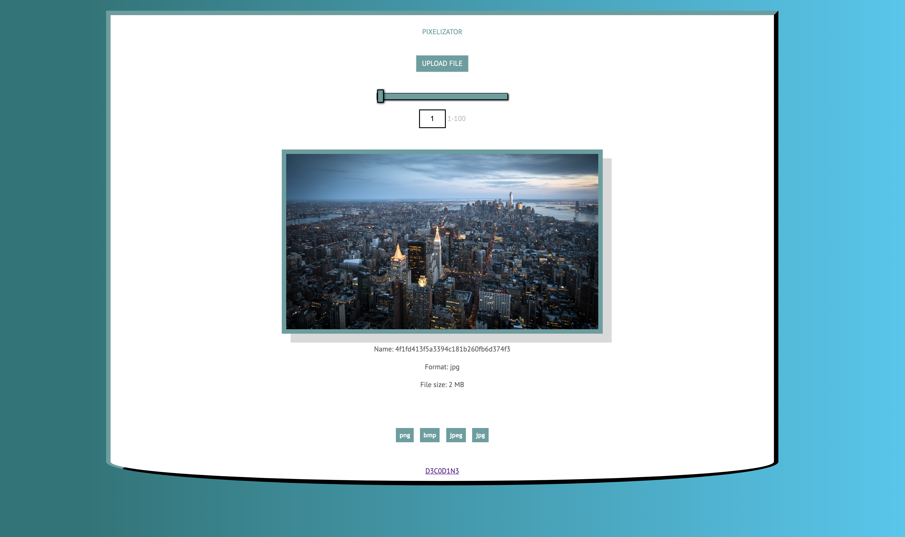
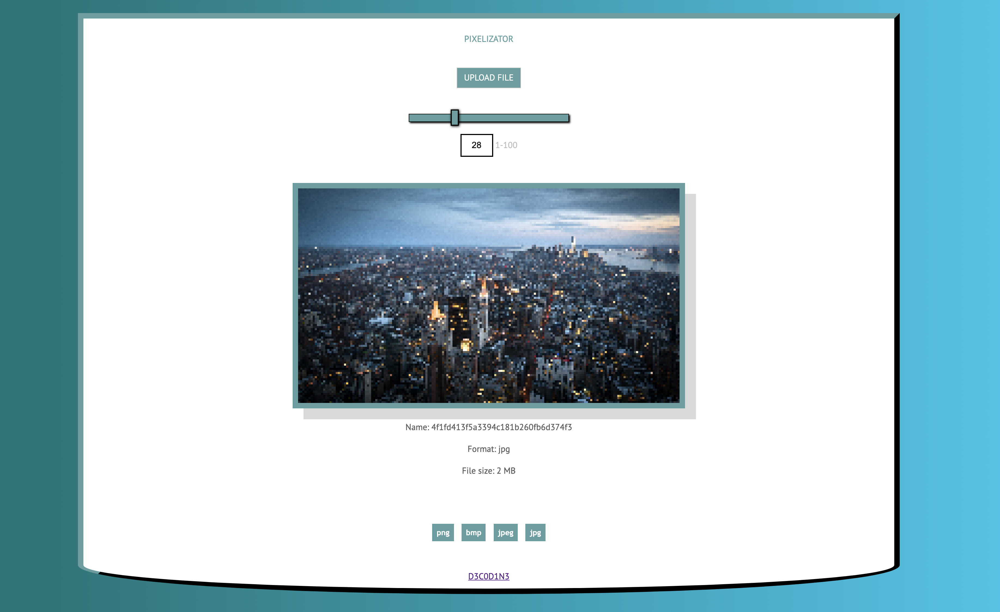

# Ucode_Pixelizator

Pixelizer of the picture.
The task is designed to familiarize yourself with the basics of the backend.
Technologies such as tomcat and servlets are used.

# Instruction

- install apache tomcat from https://tomcat.apache.org/download-90.cgi
- Enter the command ./mvnw clean package in project root
- In generated folder "target" get .war file (Ucode_Pixelizator-1.0-SNAPSHOT.war)
- Place it in your Tomcat "webapps" directory
- Run tomcat and go to http://localhost:8080/ (app name)
- Enjoy

# Screenshots

